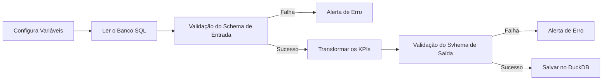

# Data Quality
Para desenvolver o desafio do negócio, vamos montar a seguinte ETL

```mermaid
graph LR
    A[Configura Variáveis] --> B[Ler o Banco SQL];
    B --> V[Validação do Schema de Entrada];
    V -->|Falha| X[Alerta de Erro];
    V -->|Sucesso| C[Transformar os KPIs];
    C --> Y[Validação do Svhema de Saída];
    Y --> |Falha| Z[Alerta de Erro];
    Y -->|Sucesso| D[Salvar no DuckDB];
```
